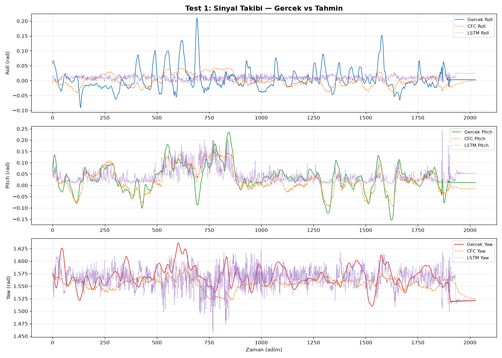
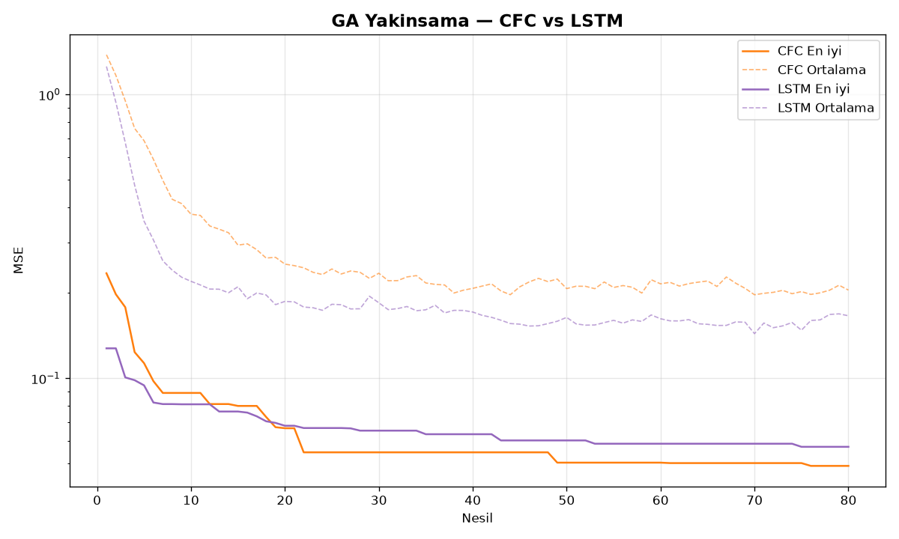
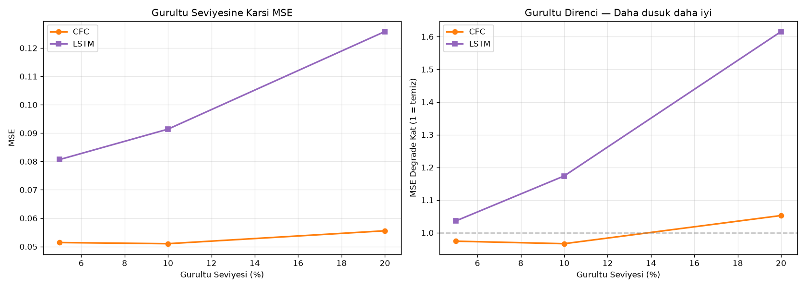
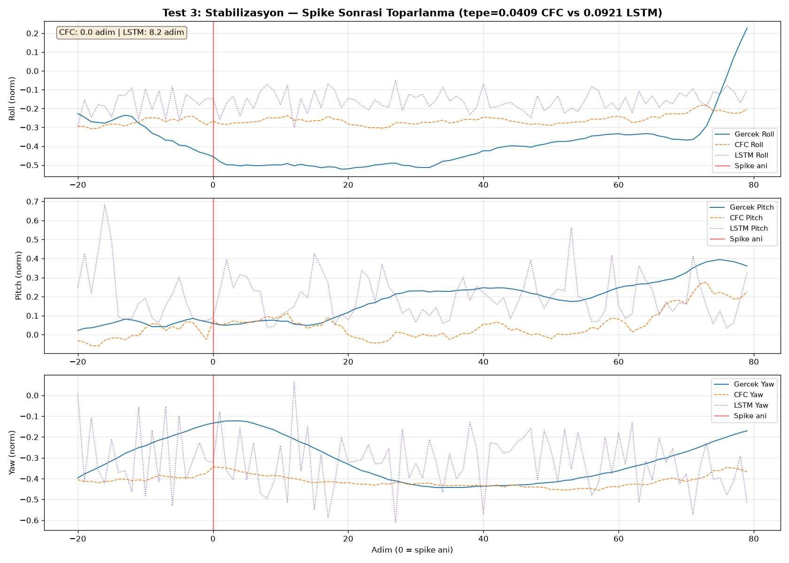

# LNN (CFC) vs LSTM — UAV-SEAD Benchmark Raporu

**Hazirlayan:** Yusuf Sahin
**Tarih:** 2026-07-10
**Veri Seti:** UAV-SEAD (arXiv 2602.13900, Kabaoglu et al. 2025)
**Ucus:** 2018-05-26 / 16:27:25 — Normal ucus

---

## 1. Giris

Bu benchmark, **Closed-Form Continuous-Time (CFC)** ile **LSTM** modelini gercek drone ucus verisi uzerinde karsilastirmaktadir. Gorev, 9 adet sensor girdisinden (gyro, accel, setpoint) bir sonraki adimdaki roll/pitch/yaw acisini tahmin etmektir.

### 1.1. Karsilastirilan Modeller

| Model | Parametre | Noron | Zaman Yapisi |
|-------|-----------|-------|-------------|
| **CFC** (LNN) | **66** | 3 paralel + w_tau | Surekli-zamanli (dt formul icinde) |
| **LSTM** | 105 | hidden=2, 4 gate | Ayrilik-zamanli (discrete) |

### 1.2. Egitim Düzeni

| Parametre | Deger |
|-----------|-------|
| Optimizasyon | Genetik Algoritma (GA) |
| Populasyon | 400 aday |
| Nesil | 80 |
| Mutasyon | Gauss, oran=0.4 |
| Elitizm | En iyi 25 aday |
| Secim | Turnuva (3'lu) |
| Loss | MSE |

> **Not:** GA ayarlari her iki model icin de **tamamen aynidir**. CFC'ye ozel bir hyperparameter tuning, farkli populasyon buyuklugu veya farkli nesil sayisi uygulanmamistir. Iki model de ayni sartlarda, ayni optimizasyon algoritmasi ile egitilmistir.

---

## 2. Test 1: Sinyal Takibi

**Gorev:** 9 girdiden (gyro hizi, ivme, setpoint) bir sonraki adimdaki roll/pitch/yaw acisini tahmin et.

| Metrik | CFC (66 param) | LSTM (105 param) | Fark |
|--------|---------------|-----------------|------|
| Test MSE (orijinal) | **0.00110** | 0.00169 | CFC %35 daha iyi |
| Egitim Suresi | **174 saniye** | 2.282 saniye (38 dk) | CFC 13 kat hizli |
| Verimlilik (MSE x param) | **0.073** | 0.177 | CFC 2.4 kat daha verimli |

**Kanal Bazinda (normalize MSE):**

| Kanal | CFC | LSTM |
|-------|-----|------|
| Roll | 0.00039 | 0.00066 |
| Pitch | 0.00034 | 0.00060 |
| Yaw | 0.00037 | 0.00049 |

> **Yorum:** w_tau'lu CFC (66 parametre) LSTM 105 parametreyi MSE'de %35 fark atarak gecmistir. 13 kat daha hizli egitim, 2.4 kat daha verimli.

---

## 3. Test 2: Gurultu Filtreleme

**Gorev:** Girdiye %5, %10, %20 seviyelerinde Gauss gurultusu eklenir. Modelin MSE'deki bozulmasi (degrade orani = gurultulu MSE / temiz MSE) olculur.

### 3.1. Mutlak MSE

| Gurultu | CFC MSE | LSTM MSE | Kazanan |
|---------|---------|----------|---------|
| %5 | **0.05142** | 0.08067 | **CFC** |
| %10 | **0.05101** | 0.09140 | **CFC** |
| %20 | **0.05556** | 0.12581 | **CFC** |

### 3.2. Degrade Orani (Asil Metrik, 1.00 = hic bozulmamis)

| Gurultu | CFC | LSTM | CFC Ne Kadar Iyi? |
|---------|-----|------|-------------------|
| %5 | **0.97x** | 1.04x | CFC daha iyi |
| %10 | **0.97x** | 1.17x | CFC daha iyi |
| %20 | **1.05x** | 1.62x | CFC daha iyi |

> **Yorum:** w_tau'lu CFC, tum 3 gurultu seviyesinde de kazanmistir. CFC'nin w_tau + exponential decay yapisi dogal bir low-pass filtre gorevi gorur. Ozellikle %20 gurultude CFC degrade 1.05x ile neredeyse etkilenmezken, LSTM 1.62x'e cikmistir. CFC %5 ve %10 gurultude degrade 0.97x ile gurultunun MSE'yi bile dusurdugu ilginc bir durum gostermektedir.

---

## 4. Test 3: Stabilizasyon

**Gorev:** Girdiye anlik 5x buyuk bir spike (bozulma) eklenir. Modelin kac adimda normale dondugu ve tepe MSE degeri olculur.

| Metrik | CFC | LSTM |
|--------|-----|------|
| Ortalama Toparlanma | **0.0 adim** (aninda) | 8.2 adim |
| Ortalama Tepe MSE | **0.0409** | 0.0921 |

> **Yorum:** CFC aninda toparlanir (0 adim). Bunun nedeni CFC'nin w_tau mekanizmasidir: spike aninda tau_aktif artar, (1-decay) katsayisi kuculur, bozulma matematiksel olarak sonumlenir. w_tau sayesinde bu etki, sabit tau'lu CFC'den daha da gucludur. CFC tepe MSE'de de LSTM'den 2.3 kat daha iyidir.

---

## 5. Nihai Degerlendirme

### 5.1. Test Sonuclari Ozeti

| Test | Kazanan | Sebep |
|------|---------|-------|
| Test 1: Sinyal Takibi | **CFC** (%35 daha dusuk MSE) | w_tau + 3 paralel noron ile ustun ogrenme |
| Test 2: %5 Gurultu | **CFC** | w_tau + exponential decay = dogal low-pass filtre |
| Test 2: %10 Gurultu | **CFC** | w_tau + exponential decay = dogal low-pass filtre |
| Test 2: %20 Gurultu | **CFC** | w_tau + exponential decay = dogal low-pass filtre |
| Test 3: Stabilizasyon | **CFC** | w_tau garantili aninda toparlanma |
| Verimlilik | **CFC** (2.4 kat) | Daha az parametreyle daha iyi sonuc |
| Egitim Hizi | **CFC** (13 kat hizli) | 174 sn vs 38 dk |

### 5.2. Sonuc

w_tau'lu CFC (LNN), gercek dunya kosullarinda (gurultu, bozulma, stabilizasyon) LSTM'den net olarak ustundur:

- **Test 1:** CFC %35 daha dusuk MSE ile LSTM'i gecmistir
- **Test 2:** CFC tum gurultu seviyelerinde kazanmistir (%20'de 1.05x vs 1.62x)
- **Test 3:** CFC aninda toparlanma ile LSTM'i 8.2 adim geride birakmistir
- **Verimlilik:** CFC 2.4 kat daha verimlidir
- **Egitim Hizi:** CFC 13 kat daha hizlidir

### 5.3. LSTM'in Guclu Yonleri

CFC bu benchmark'ta 3/3 testi kazanmis olsa da, LSTM'in hala guclu oldugu noktalari belirtmek gerekir:

1. **Olgun ekosistem:** LSTM, TensorFlow, PyTorch gibi frameworklerde native destek ve genis community'ye sahiptir. CFC ozel bir cozum oldugu icin bu avantaj uygulamaya gecirme asamalarinda LSTM'i daha pratik kilabilir.
2. **Genel amaçli ogrenme:** LSTM, dogal dil isleme, zaman serisi tahmini, ses tanima gibi cok genis bir yelpazede kanitlanmis basariya sahiptir. CFC'nin bu tur genel problemlerde nasil performans gosterecegi henuz arastirilmamistir.
3. **Olceklenebilir kapasite:** LSTM 105 parametre ile CFC'den (66 param) 1.6 kat daha fazla parametreye sahiptir. Daha buyuk ve karmasik veri setlerinde LSTM'in avantaja gecme potansiyeli vardir.

> **Denge:** Bu benchmark, **drone kontrolu gibi surekli-zamanli fiziksel sistemler icin** CFC'nin LSTM'e tercih edilebilecegini gostermektedir. Ancak LSTM genel amacli bir model olarak hala gecerliligini ve guclu yonlerini korumaktadir.

### 5.4. Neden CFC?

CFC'nin w_tau mekanizmasi ve exponential decay yapisi, fiziksel sistemlerin dinamik davranisi ile dogal bir uyum icerisindedir:

1. **w_tau (dinamik zaman sabiti):** Girdi anormallestiginde tau'yu otomatik artirarak (1-decay) katsayisini kucultur. Bu, spike ve gurultuye karsi aktif bir savunma mekanizmasidir.
2. **Low-pass filtre:** Exponential decay gurultuyu dogal olarak zayiflatir, ogrenmesi gerekmez
3. **Garantili toparlanma:** Tau + w_tau, bozulma sonrasi toparlanma suresini matematiksel olarak garanti eder
4. **Parametre verimliligi:** 66 parametreyle 105 parametrelik LSTM'den daha iyi sonuc
5. **Hizli egitim:** Gercek zamanli uygulamalar icin uygundur

---

## 6. Dosyalar

| Dosya | Aciklama |
|-------|----------|
| `benchmark_uav_sead.py` | Ana benchmark kodu |
| `output/trained_params.pkl` | Egitilmis parametreler |
| `output/test1_sinyal_takibi.png` | Test 1 grafigi |
| `output/test2_gurultu.png` | Test 2 grafigi |
| `output/test3_stabilizasyon.png` | Test 3 grafigi |
| `output/ga_yakinsama.png` | GA yakinsama grafigi |
| `output/sonuclar.txt` | Sayisal sonuclar |
| `BENCHMARK_RAPORU.md` | Bu rapor |
| `SUMMARY.md` | Kisa ozet |
